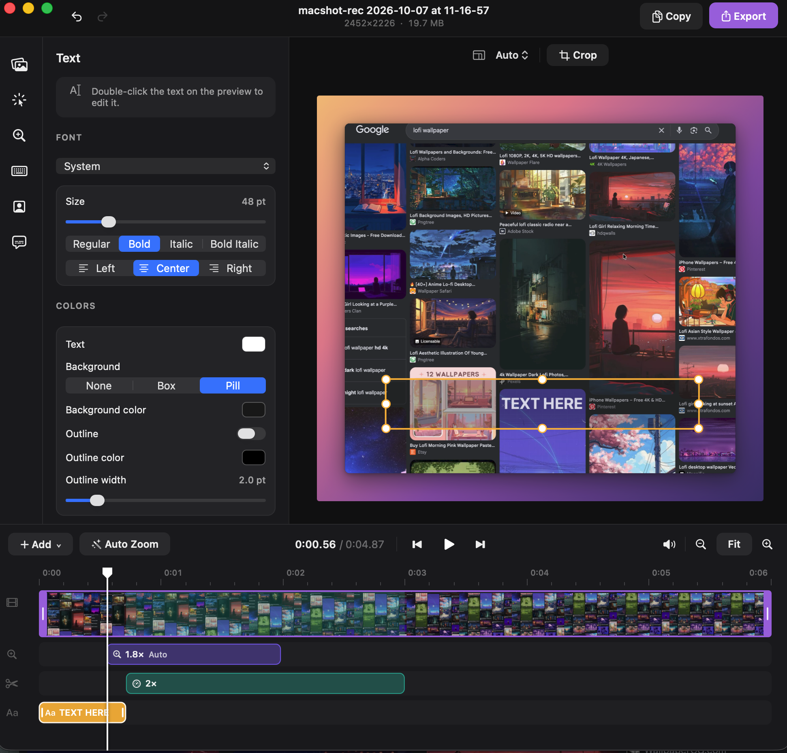

# macshot Studio

> **Based on [macshot](https://github.com/sw33tLie/macshot) by [sw33tLie](https://github.com/sw33tLie).**
> All of the video editor (timeline, effects, zooms, rendering, export) is macshot's work. This
> project only packages that editor as a standalone app and adds pointer detection for videos
> macshot didn't record. If you want screenshots, annotation and screen recording, use macshot itself.



A standalone dock app that opens **any** video in [macshot](https://github.com/sw33tLie/macshot)'s
video editor (trim, cuts, speed, freeze, blur/censor, text, zooms, backgrounds/framing, crop,
aspect presets, captions, MP4/GIF export). It doesn't do screen capture, so it needs no
Screen Recording permission and no menu-bar app.

It builds directly from a macshot checkout: `sync-sources.sh` symlinks every upstream `.swift` file
except `AppDelegate.swift` and `main.swift`. Those two are replaced by `Sources/MacshotStudio/Studio/`.
`patches/` holds small changes applied to copies of upstream files, in order:

- `01`, `02`: type annotations upstream needs to compile with Xcode 26.2
- `03`: load pointer data for videos macshot didn't record
- `04`: the export popover scrolls instead of clipping its top on macOS 26
- `05`: the timeline's skim line shows only over the ruler and video track, not over zoom/edit/text items
- `06`: the clip fills the timeline on first open (it was sized before the window's layout)

## Build

```sh
git clone https://github.com/sw33tLie/macshot.git
git clone https://github.com/swastij/macshot-studio.git
cd macshot-studio
./build-app.sh            # -> build/macshot Studio.app
./build-app.sh --install  # also copies it to ~/Applications
```

Needs Xcode 26 and the macshot clone at `../macshot` (or set `MACSHOT_SRC=/path/to/macshot/macshot`).
To update: `git -C ../macshot pull && ./build-app.sh --install`.

## Use

- Launch it to get the editor, then drop a video onto the preview or click **Choose Video…**
  (or use **File > Open Video… (⌘O)**)
- Drag videos onto the Dock icon, or use **Open With > macshot Studio** in Finder
- From a terminal: `open -a "macshot Studio" clip.mov`

## Pointer and zoom on any video

macshot's pointer restyling and Auto Zoom need pointer data that it records alongside its own
recordings. Studio recreates that data from the video itself. When you open a video it asks:

- **Replace Pointer**: finds the pointer in every frame, paints it out of a copy of the video, and
  lets the editor draw its own. You can then restyle it (macOS, dot or ring), resize, smooth and
  hide it, add click effects, and use Auto Zoom and zooms that follow the pointer.
- **Track Only**: keeps the recorded pointer and uses its positions for Auto Zoom and follow zooms.
- **Skip**: opens the video as is.

Set a default under the **Pointer** menu. Results are cached per file, so reopening a video is
instant. Use **Pointer > Open Video and Detect Pointer Again…** to redo one.

How it works (`Sources/MacshotStudio/Studio/Pointer/`):

- **Tracking**: the real macOS cursor images (arrow, hand, I-beam, grab, resize…) are matched
  against each frame, in half-pixel phases, only where the screen changed. The pointer moves, so
  pointer-like icons in the content are ignored. The scale (Retina 2×, a downscaled export…) is
  worked out from the video.
- **Clicks** are inferred where the pointer travels, stops, and the screen reacts. **Typing** is
  inferred where the pointer hides while text changes nearby. Auto Zoom uses both.
- **Removal** fills each pointer box from the last time those pixels were visible. If a click changed
  what was under a parked pointer, it fills from when the pointer moves off. If content scrolls
  under a parked pointer, it follows the scroll. As a last resort it uses the surrounding color.

Limits: detection needs the standard macOS pointer, shown in the video. A custom or enlarged cursor,
or a Windows or Linux recording, won't be found. Clicks and typing are guesses: a hover that changes
the UI can look like a click, and a click with no visible effect is missed. Adjust zooms on the
timeline as needed. Replace mode writes a high-quality HEVC copy to
`~/Library/Application Support/macshot Studio/Pointer/`. You can delete that folder at any time.
Webcam tracks and macshot's keystroke labels still need macshot's own recordings.

Edits autosave to `~/Library/Application Support/com.sw33tlie.macshot/VideoProjects/`, the same place
macshot uses. Your source file is never modified.

## Testing

```sh
swiftc -O -o /tmp/mktest Tools/make-test-video.swift
/tmp/mktest ../macshot/assets/preview-editor.png /tmp/test.mov 2          # pointer + truth JSON
NO_POINTER=1 /tmp/mktest ../macshot/assets/preview-editor.png /tmp/ref.mov 2
BIN=$(swift build -c release --show-bin-path)/MacshotStudio
$BIN --analyze /tmp/test.mov --mode replace --dump /tmp/dump.json         # headless detection
python3 Tools/evaluate.py /tmp/dump.json /tmp/test.truth.json             # tracking accuracy
swift Tools/compare-erase.swift /tmp/test.mov <cleaned.mov> /tmp/ref.mov /tmp/test.truth.json
$BIN --render <cleaned.mov> /tmp/out.mp4 --style dot                      # Auto Zoom + export via macshot
```

## Credits and license

macshot Studio is a derivative of [macshot](https://github.com/sw33tLie/macshot), © sw33tLie and
contributors, licensed under the GNU General Public License v3.0. The macshot source is used from an
upstream checkout at build time; `Sources/MacshotStudio/Studio/CaptureMenuItemID.swift` and the
files in `patches/` contain code copied or modified from it.

This project is licensed under the GNU General Public License v3.0 as well. See [LICENSE](LICENSE).
It is not affiliated with or endorsed by the macshot project.

